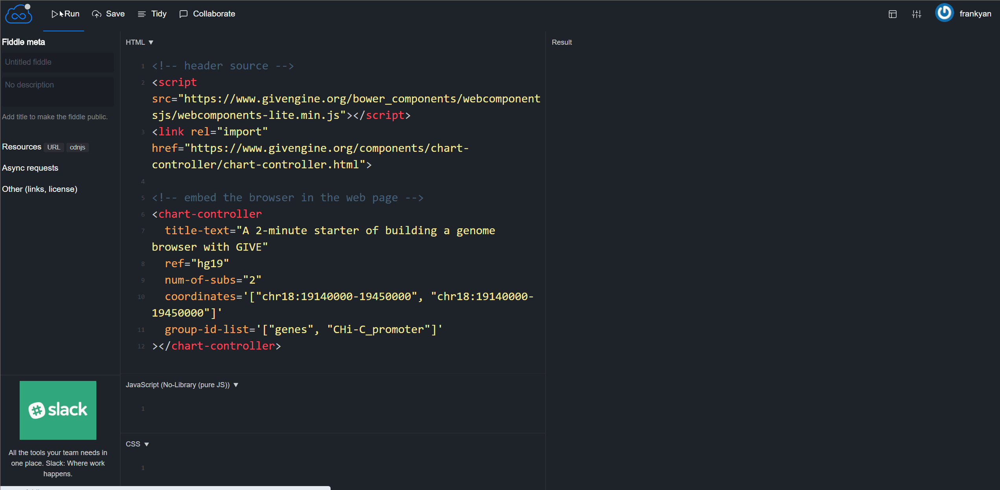
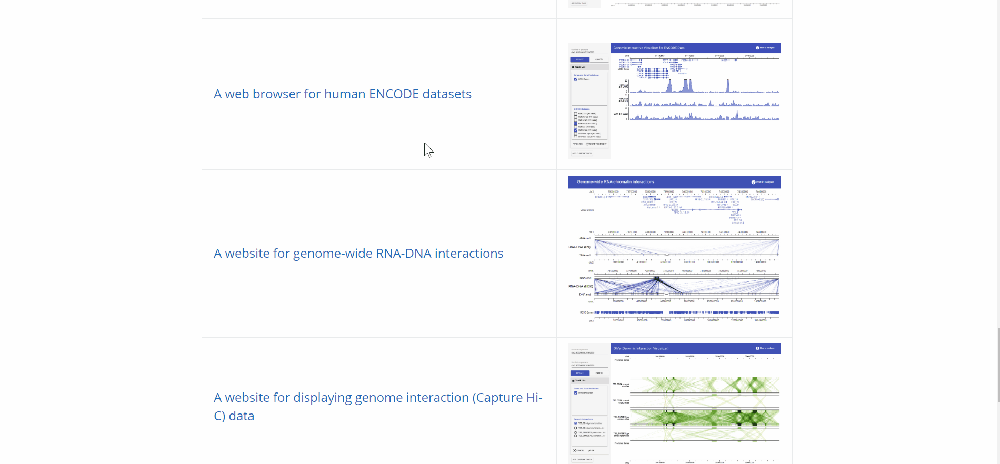
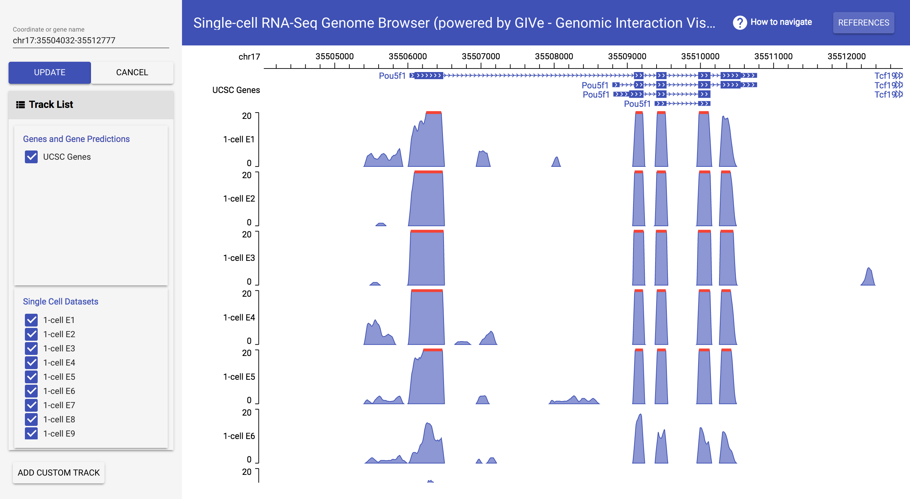
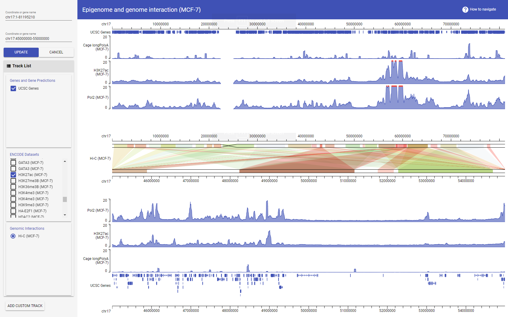
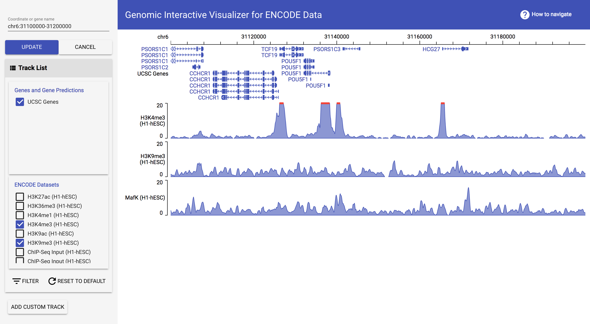
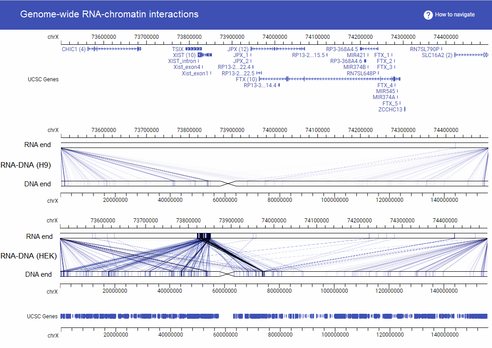
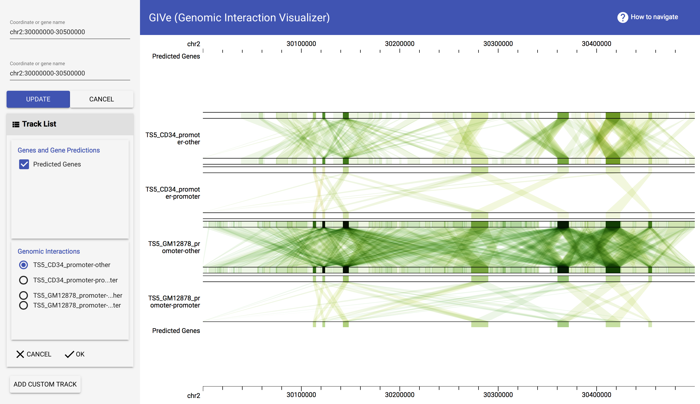
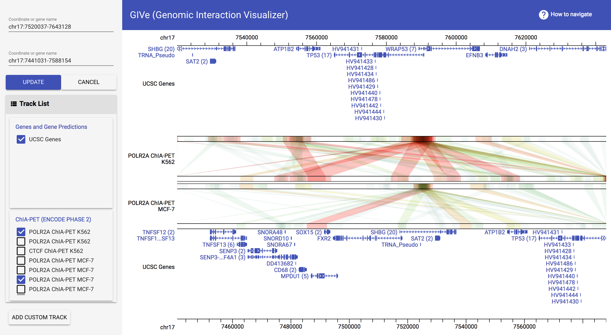

__*GIVE*__  is an open source programming library that allows anyone without much programming experience to build custom genome browser websites or apps. With a few lines of codes, one can set up GIVE service on a local machine, manage custom data and build an interactive genome browser. Besides, we established **GIVE Data Hub**, a data center providing GIVE service and hosting public/customer data sets. It takes only a few minutes to build a genome browser website using GIVE-Hub.

This portable library encapsulates novel data communication and data visualization technologies, including new data structures and new memory management methods that enable efficient data transfer between the data-hosting website and internet browsers. 
GIVE is the acronym of **G**enomic **I**nteraction **V**isualization **E**ngine, although GIVE's utilities have outgrown its original name.

## [**GIVE Tutorials**](https://github.com/Zhong-Lab-UCSD/Genomic-Interactive-Visualization-Engine/tree/master/tutorials)
From zero to expert! Step-by-step tutorials with comprehensive examples show you how to elegantly customize a genome browser with GIVE.
## [**GIVE Manuals**](https://github.com/Zhong-Lab-UCSD/Genomic-Interactive-Visualization-Engine/blob/master/manuals/)
Technical details for users or developers who want to learn more about how GIVE works.
## [**GIVE Data Hub**](https://www.givengine.org/give-data-hub.html)
An interactive website for browsing datasets host on public data servers. An interactive feature inside data hub automatically generates HTML files for displaying user chosen datasets, thus relieving the user from doing any programming. The generated HTML file can be saved and shared, or copy-pasted into personal websites. 

If you want your own data to be included in GIVE Data Hub (the public GIVE instance). Please use [Data Submission to GIVE Data Hub form](https://goo.gl/forms/alI3NFifNiwFt8fp1) to submit your information to the GIVE team. We will contact you for further details if your data are selected to be included in GIVE Data Hub.

## [A 2-minute Example](https://jsfiddle.net/frankyan/mcdng033/)
Just copy paste the following HTML code to [jsfiddle](https://jsfiddle.net/), an online HTML testing website for testing of your own HTML code. 1) Go to  [jsfiddle](https://jsfiddle.net), 2) copy paste the following lines to the HTML panel (top left), 3) hit the "run" button.
Congratulations! You have built your first genome browser webpage using GIVE Data Hub data source in less than 1 minute. 
```html
<!-- header source -->
<script src="https://www.givengine.org/bower_components/webcomponentsjs/webcomponents-loader.js"></script> 
<link rel="import" href="https://www.givengine.org/components/chart-controller/chart-controller.html">

<!-- embed the browser in the web page -->
<chart-controller 
  title-text="A 2-minute starter of building a genome browser with GIVE" 
  ref="hg19" 
  num-of-subs="2" 
  coordinate='["chr18:19140000-19450000", "chr18:19140000-19450000"]'
  group-id-list='["genes", "CHi-C_promoter"]'
></chart-controller>
```
So you have enough time to learn some essential tips for customizing your genome browser. Please read the [GIVE Tutorial 0: Start from a 2 minutes example](https://github.com/Zhong-Lab-UCSD/Genomic-Interactive-Visualization-Engine/blob/master/tutorials/0-shortexample.md). The following GIF animation shows the whole process of the 2 minute tutorial. It's so easy.



How can you use your own data instead of GIVE Data Hub data source? Just learn more from [GIVE tutorials](https://github.com/Zhong-Lab-UCSD/Genomic-Interactive-Visualization-Engine/tree/master/tutorials)! You can set up your own GIVE service and build a powerful genome browser with your own data in less than 2 hours!

## Add custom data track
For the lastest version of GIVE engine, you could upload your local data by uploading files from your computer or, load in data from remote repository with its url! 
Currently GIVE accept:
- Bed file
- Interaction file
- Bigwig file (only supported load from url)
 
### Example: add bigwig file from URL
The bigWig format is useful for dense, continuous data that will be displayed, The bigWig files are in an indexed binary format and is fast to retrieve and display a particular region. Because of this, bigWig files have considerably faster display performance than regular wiggle files when working with large data sets. 

Let's see how to add an example bigwig file provided by UCSC. 
The example url we're using is: http://genome.ucsc.edu/goldenPath/help/examples/bigWigExample.bw. 

*The example file only contains data of Chr21. 

****************

## Examples of custom genome browsers built with GIVE using GIVE-Hub data source

<table>
  <tr style="padding-bottom:10px;">
    <td width="60%">
      <a href="https://singlecell.genemo.org">Single-cell transcriptome website</a>
    </td>
    <td width="40%">
      <a href="https://singlecell.genemo.org"></a>
    </td>
  </tr>
</table>

<table>	
  <tr>	
    <td width="60%">	
      <a href="https://mcf7.givengine.org">A website for displaying genome interaction (Hi-C) data together with other data types</a>	
    </td> 	
    <td width="40%">	
      <a href="https://mcf7.givengine.org"></a>	
    </td>	
  </tr>	
</table>

<table>
  <tr>
    <td width="60%">
      <a href="https://encode.genemo.org">A web browser for human ENCODE datasets</a>
    </td>
    <td width="40%">
      <a href="https://encode.genemo.org"></a>
    </td>
  </tr>
</table>

<table>
  <tr>
    <td width="60%">
      <a href="https://margi.givengine.org">A website for genome-wide RNA-DNA interactions</a>
    </td>
    <td width="40%">
      <a href="https://margi.givengine.org"></a>
    </td>
  </tr>
</table>

<table>
  <tr>
    <td width="60%">
      <a href="https://chic.givengine.org">A website for displaying genome interaction (Capture Hi-C) data</a>
    </td>
    <td width="40%">
      <a href="https://chic.givengine.org"></a>
    </td>
  </tr>
</table>

<table>
  <tr>
    <td width="60%">
      <a href="https://chiapet.givengine.org">A website for displaying genome interaction (ChIA-PET) data</a>
    </td>
    <td width="40%">
      <a href="https://chiapet.givengine.org"></a>
    </td>
  </tr>
</table>
----------------

Citation: Xiaoyi Cao, Zhangming Yan, Qiuyang Wu, Alvin Zheng, Sheng Zhong, GIVE: portable genome browsers for personal websites, *Genome Biology*, 2018, __19__:92. <https://doi.org/10.1186/s13059-018-1465-6>.

----------------

© COPYRIGHT 2017 GIVE Authors. Code Licensed under the Apache License 2.0. Documentation licensed under CC BY 3.0. 
