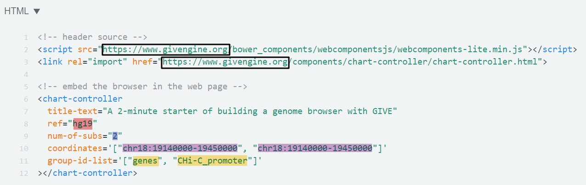

__*GIVE*__  is an open source programming library that allows anyone with HTML programming experience to build custom genome browser websites or apps.  With a few lines of codes, one can add to a personal webpage an interactive genome browser that host custom data. It typically takes less than an hour to build a genome browser website with GIVE. 
This portable library encapsulates novel data communication and data visualization technologies, including new data structures and new memory management methods that enable efficient data transfer between the data-hosting website and internet browsers.  
GIVE is the acronym of **G**enomic **I**nteraction **V**isualization **E**ngine, although GIVE's utilities have outgrown its original name.

[GIVE Tutorial](https://github.com/Zhong-Lab-UCSD/Genomic-Interactive-Visualization-Engine/tree/master/tutorials)  | [GIVE Manual](https://github.com/Zhong-Lab-UCSD/Genomic-Interactive-Visualization-Engine/blob/master/manuals/) 
-------------------------------------------------------------------------------------------------------------------|-------------------------------------------------------------------------------------------------------------------------------
From zero to expert! Step-by-step tutorials with comprehensive examples show you how to elegently customize a genome browser with GIVE.  .                                                                     | Full technical details for users or developers who want to learn more about how GIVE works.                                                                                               

## [A 2-minute starter](https://jsfiddle.net/frankyan/mcdng033/)

Just copy paste the following HTML codes to [jsfiddle](https://jsfiddle.net/), an online HTML testing website for testing of your own HTML codes. 1) Go to  [jsfiddle](https://jsfiddle.net), 2) copy paste the following lines to the HTML panel (top left), 3) hit "run" button.
Congratulations! You are seeing your first genome browser webpage. 
```html
<!-- header source -->
<script src="https://www.givengine.org/bower_components/webcomponentsjs/webcomponents-lite.min.js"></script> 
<link rel="import" href="https://www.givengine.org/components/chart-controller/chart-controller.html">

<!-- embed the browser in the web page -->
<chart-controller 
  title-text="A 2-minute starter of building a genome browser with GIVE" 
  ref="hg19" 
  num-of-subs="2" 
  coordinates='["chr18:19140000-19450000", "chr18:19140000-19450000"]'
  group-id-list='["genes", "CHi-C_promoter"]'
></chart-controller>
```
It's much less than 2 minutes. So you have some time to learn essential tips for customizing your genome browser. Following HTML code illustration figure shows you all the information you need.



In this example, the genomic track data are hosted on the GIVE-Hub, which is a data center for GIVE users maintained by Zhong Lab in UCSD. We have collect thousands of data. Check out.
you can tweak the codes to 

Want to host your own data hub? Of course, you can! Learn more from our tutorial, you only need to know 


****************

## Examples of custom genome browsers built with GIVE

<table>
  <tr style="padding-bottom:10px;">
    <td width="60%">
      <a href="https://singlecell.genemo.org">Single-cell transcriptome website</a>
    </td>
    <td width="40%">
      <a href="https://singlecell.genemo.org"></a>
    </td>
  </tr>
</table>

<table>
  <tr>
    <td width="60%">
      <a href="https://encode.genemo.org">A web browser for human ENCODE datasets</a>
    </td>
    <td width="40%">
      <a href="https://encode.genemo.org"></a>
    </td>
  </tr>
</table>

<table>
  <tr>
    <td width="60%">
      <a href="https://margi.givengine.org">A website for genome-wide RNA-DNA interactions</a>
    </td>
    <td width="40%">
      <a href="https://margi.givengine.org"></a>
    </td>
  </tr>
</table>

<table>
  <tr>
    <td width="60%">
      <a href="https://chic.givengine.org">A website for displaying genome interaction (Capture Hi-C) data</a>
    </td>
    <td width="40%">
      <a href="https://chic.givengine.org"></a>
    </td>
  </tr>
</table>

<table>
  <tr>
    <td width="60%">
      <a href="https://chiapet.givengine.org">A website for displaying genome interaction (ChIA-PET) data</a>
    </td>
    <td width="40%">
      <a href="https://chiapet.givengine.org"></a>
    </td>
  </tr>
</table>
----------------

Citation: Xiaoyi Cao, Zhangming Yan, Qiuyang Wu, Alvin Zheng, Sheng Zhong, Building a genome browser with GIVE,  bioRxiv, 2017, [https://doi.org/10.1101/177832](https://doi.org/10.1101/177832).

----------------

© COPYRIGHT 2017 GIVE Authors. Code Licensed under the Apache License 2.0. Documentation licensed under CC BY 3.0. 
